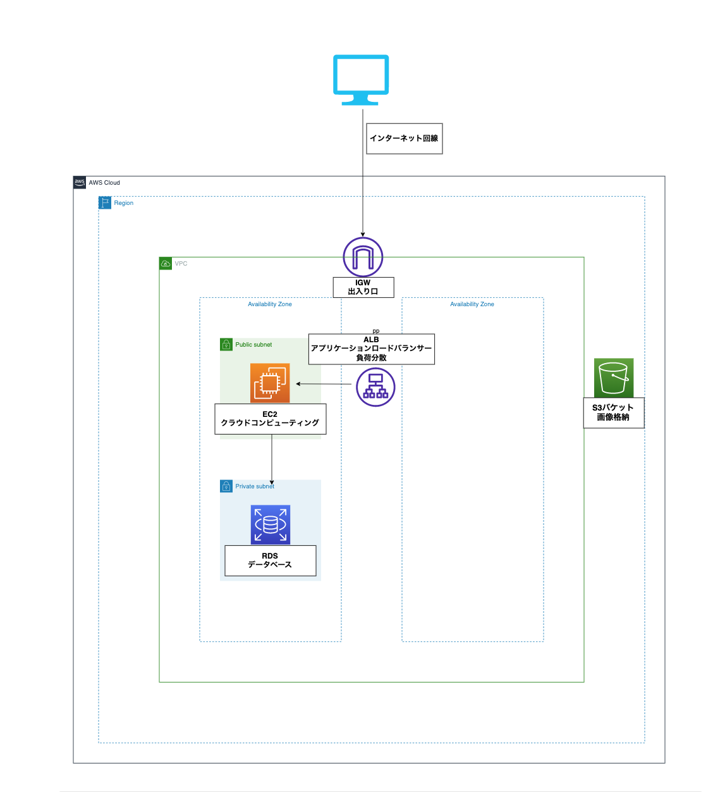

##  構成図

## その他第5回課題で参考にしたサイト

### tail コマンド(リアルタイムでlogを確認する時に使用)
- [tailコマンド参照サイト](https://www.aura-office.co.jp/blog/tail/)
- [tailコマンド参照サイト2](https://did2memo.net/2013/04/23/how-to-pause-tail-f/)

### rm・mvコマンド　(ファイルの削除・名前の変更)
- [rm・mvコマンド参照サイト](https://atmarkit.itmedia.co.jp/ait/articles/1606/06/news013.html)

#### ブラウザで確認する際はchromeのデベロッパーツールも参考になった。

#### 他セクションの課題まとめ(ALB、S3、組み込みサーバー動作、nginx等)
[lecture05_セクション毎の課題まとめファイル](https://github.com/yuhei1012/RaiseTech_summary/blob/47790a59817f1fc7bf439616cb502eddb9b147e8/lecture05/Sectionfile/section.md)

総括

　今回は相当時間が掛かってしまった。
11月中旬から第５回課題に取り組んだが4ヶ月を要してようやく達成できた。
自分より遅くに課題に取り組んだ何人もの人が速いペースで課題を終わらせていたので焦りを強く感じた課題であった。
このままフェードアウトしてしまいそうだったが達成することができて本当に良かった。
今回これほど時間掛かってしまったポイントは下記のことだと思う。
##### ・コマンドを実行するべきディレクトリで実行していない（nginxとunicornをapp階層ではなくec2のhomeディレクトリで実行していた）
##### ・一つのコマンドだけしか試さない(puma起動の際 $ rails sコマンドで起動してブラウザで確認していたが上手くいかなかった。 $ rais s -b 0.0.0.0でやると上手くいった)
##### ・基本的なミスでエラーが出力されているが、エラーコードを調べて違う原因のサイトをいくつも巡り正解にたどり着かない。

ほぼ出来ていたのに自分で難しくしていた部分は多かったと思うが、検索するワードをもっと工夫しなければいけないのも反省すべき点である。
柔軟に考えなければいけないのは分かっているが中々難しい。だが、それが今の自分の実力なのでとにかく前に進むしかない。

githubでの相対パスで画像を表示することに少し時間が掛かってしまった。
出来てしまえば簡単だが、調べることや色々と試す内にできるようになった。
ただ、これは簡単なことだったので想定外に時間が掛かったことは反省しなければならない。

