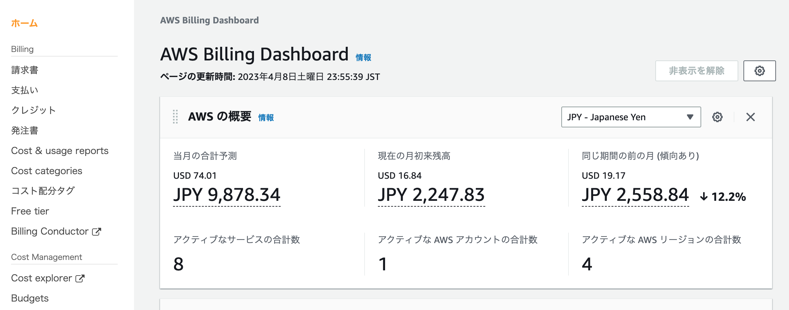
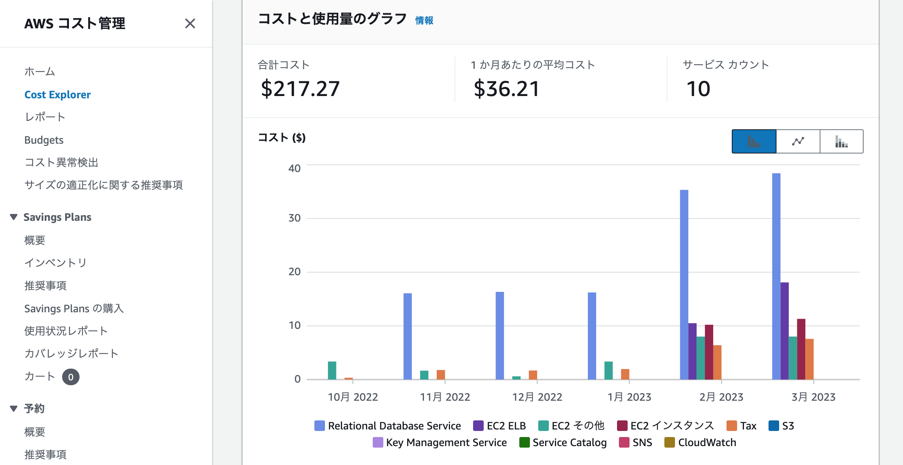
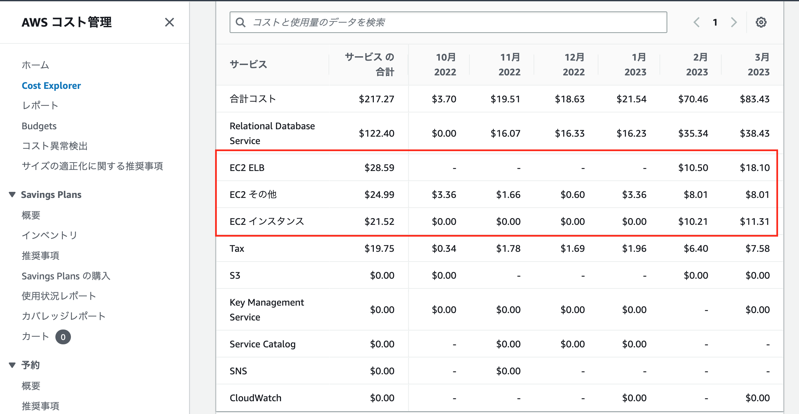

# AWS利用料の見積り

[AWS_Pricing_Calculator](https://calculator.aws/#/estimate?id=5b6cca2cd932d7e3269af198188ba247ee7d5adc)

＊必要事項を追記した後にシェアを忘れずに押下すること

# AWSサービスの現在の利用料

# 各サービスの料金

-EC2は無料枠に収まっていない。アカウントを作成してから既に一年以上が経過しているので課題を速く終わらせたいと思った

[CloudWatchアラーム設定.mdファイル](https://github.com/yuhei1012/lecture/blob/8213472f6270982bc4ab4166f2e255766554bd0b/lecture06_CloudWatch%E3%82%A2%E3%83%A9%E3%83%BC%E3%83%A0%E8%A8%AD%E5%AE%9A.md)

[Cloudtrailイベント確認.mdファイル](https://github.com/yuhei1012/lecture/blob/8213472f6270982bc4ab4166f2e255766554bd0b/lecture06_Cloudtrail%E3%82%A4%E3%83%99%E3%83%B3%E3%83%88%E7%A2%BA%E8%AA%8D.md)
