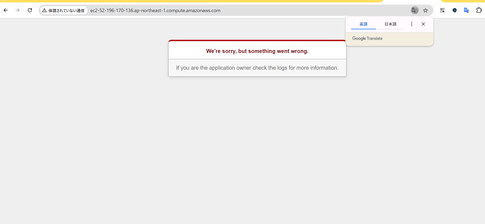

# 第13回　CircleCiを活用した自動化

- CI/CDツールを使用してセットアップから構築、デプロイ、serverspecを使用してテスト実行までを自動化

- CircleCiを使用しCFnでリソースを作成、作成されたリソースにAnsibleでRails環境とアプリケーションのセットアップ、最後にserverspecでテストを実行する構成となる。

- アクセスキーやパスワードの記述が必要になるためセキュリティ、ハードコーティングの観点からCircleCiのEnvironment Variables(環境変数)機能は必須となる。

### CircleCiでの作成画面

### CFn成功

### Ansible成功

### Serverspec成功

### アプリケーション画像確認

##### 　ハマったポイント

- Pumaの起動でハマってしまった。
Pumaが起動しないのは自分の経験上ファイル構文に問題がある場合が多い。大抵はそこを修正すると動く。
development.rb、puma.rb、puma.serviceこの内のどれかに問題がある。

Puma起動エラー

Pumaブラウザアクセスエラー

Puma起動成功

### アプリケーションをブラウザからアクセスした時画像が表示されない。

  
"config.active_storage.variant_processor = :mini_magick"をapplication.rbに追記し
RAILS_ENV=development bundle exec rails assets:precompileを実行する構文にすること。
precompileを実行するコマンドがないとapplication.rbに記述されなかった。
playbookに直接記述するよりもテンプレート(development.rb.j2)を使用するのが有効であった。
ImageMagickのインストールやminimagickをGemfileに追加する構文も必須である。

##### development.rbの記述にも注意が必要であった。
- config.active_storage.service = :amazon→表示される
- config.active_storage.service = :local→表示されない

 
必要な記述と更新ができないとブラウザからアクセスすると下記のようになる。

- Serverspecの項目では.ssh/configの設定が以前の課題のものになっておりssh接続でのエラーが出続けた。
そこの設定を今回の課題のものにし、テストが実行された。

- インデントのずれによる構文エラーが多かった。

## 総括
今回の課題はかなりの時間を要することとなり、難しい課題であった。
最初はlocalでAnsibleを成功させるところから始めたが、これも中々うまくいかず苦労をした。
しかしできてしまえば10分程で作成、デプロイ、テストが実行できるので非常に便利なツールであると感じた。
業務として使用できるレベルではないのでまだまだ学習は継続していきたい。

### 構成の流れ

この図の構成では、CircleCIのプロジェクトがAnsibleのコントロールノードとして機能しています。具体的には、CircleCIがCI/CDパイプラインを実行する際に、Ansibleを用いてEC2インスタンス（ターゲットノード）にリモート接続し、設定やデプロイを行う役割を果たしている。

以下のような流れとなる：

1. GitHubにコードがプッシュされる: これがCircleCIのビルドプロセスをトリガーします。
2. CircleCIがジョブを実行: CircleCI上のパイプラインの一環として、Ansibleが起動します。この時点で、CircleCIの環境（CircleCIのプロジェクト）自体がAnsibleのコントロールノードとして動作。
3. Ansibleがターゲットノードに接続: CircleCI上のAnsibleは、設定されたEC2インスタンスにSSHなどを使って接続し、アプリケーションのセットアップや設定（NginxやRailsの構築）を行う。したがって、CircleCIのジョブがコントロールノードの役割を担い、EC2インスタンスがAnsibleの指示に従って構成されるという流れである。

これにより、開発者は手動でEC2にログインして設定を行う必要がなくなり、コードがプッシュされるたびにCircleCIが自動的にインフラを構成・デプロイすることとなる。

# 構成図

## CircleCiでAnsible、Serverspecまで実行する際の注意点
このリポジトリーのファイルを引用して同じことをする際は以下の点を変更すること。
- inventoryファイルのipアドレスを変更すること
- EC2のPublic_IPアドレスを変更すること
- S3のバケット名を変更すること。又は削除しておくこと。
- CircleCiの環境変数を変更すること。
  AWSアクセスキーやシークレットアクセスキーを新たに作成、登録すること。
  変更の必要がなければ同じものでも可。
- .ssh/configのhost(ipアドレス)を変更すること

  

